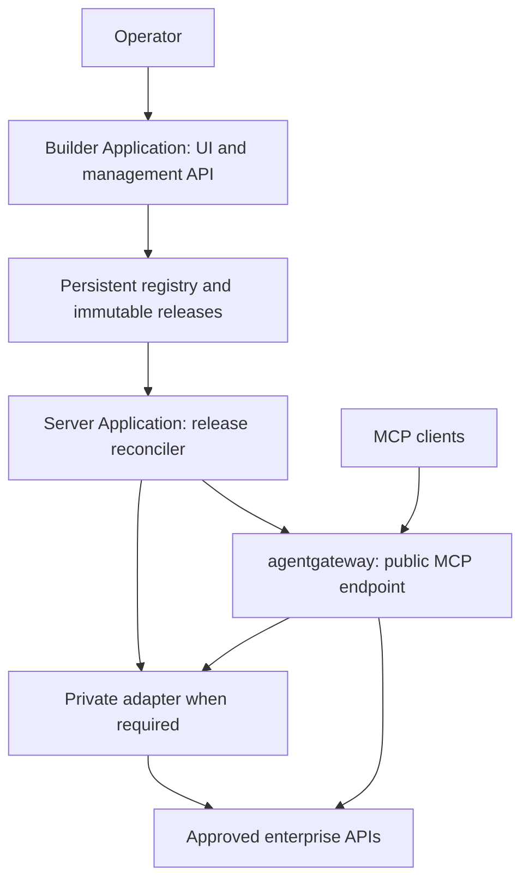

# MCP Factory — Developer Project Plan

**Design baseline:** 6 October 2026  
**Deployment target:** Cloudera AI Workbench Applications using a custom ML Runtime  
**Protocol target:** MCP 2026-07-28; separately tested compatibility with MCP 2025-11-25  
**Status:** Implementation plan; deployment and upstream compatibility gates remain to be proven.

## 1. Product definition and foundation

MCP Factory is a reusable toolset for creating, operating, and updating MCP servers in Cloudera AI Workbench projects. An operator launches the applications, connects an existing API, selects or defines operations, tests them, and publishes tools while the MCP application continues running. The same package must support unrelated business APIs without domain-specific code.

The runtime image packages executable dependencies. The project template supplies application launchers and bootstrap configuration. Persistent records hold connections, tool drafts, immutable releases, policies, and audit history. A custom Runtime is an execution environment; it does not itself create a Workbench project or its Applications.

**Confirmed foundation:** Use the open-source **agentgateway** project at https://agentgateway.dev/ and https://github.com/agentgateway/agentgateway. The user has confirmed this project and the MCP 2026-07-28 specification. Solo.io introduced the gateway; its documentation identifies Linux Foundation project ownership [S1, S2]. The WorkOS article supplied by the user is background reading, not the gateway implementation. WorkOS remains an optional identity integration.

**Source precedence:** The WorkOS article is dated 26 March 2026 and describes the earlier stateful protocol and roadmap [S13]. The linked July specification governs implementation where these descriptions differ. In particular, do not carry the article’s session model into the latest profile. Tools can perform read or write operations; the Factory classifies actual side effects independently of the article’s simplified “write side” description.

All architecture below is a proposed MCP Factory design. Upstream features are identified explicitly and must be checked against a pinned release. A documentation page labeled “latest” is not a dependency pin.

### Success criteria

1. A new project launches a Builder Application and a Server Application with no customer tools baked into the image.
2. An operator publishes a new REST tool after startup; discovery and invocation succeed without rebuilding the image or restarting the server process.
3. A second unrelated API is onboarded using configuration only.
4. Unpublished operations, disabled tools, and unauthorized tools cannot be executed through any exposed route.
5. Application restarts retain configuration and reconcile the active release.
6. Each published tool call identifies the principal, server, tool version, release, authorization outcome, upstream outcome, and latency in redacted telemetry.
7. The selected binary and public endpoint pass a version-specific MCP conformance suite through the actual Workbench ingress.

### V1 scope

Deliver connections, manual REST tool authoring, curated OpenAPI import, tool test playground, publish/rollback, server status, role-based administration, OAuth-protected MCP access, backend credential references, audit events, and portable export/import. Support JSON REST APIs first. Initial OpenAPI support: explicitly documented and tested 3.0.x subset; admit 3.1.x only after schema and serialization fixtures pass.

One Server Application serves one logical MCP server in V1. Multiple servers are separate Server Applications with distinct canonical URLs and credentials. The Builder may manage several explicitly registered servers, but first ship and prove one project with one Builder and one Server Application.

### Deferred

SQL/JDBC, gRPC, GraphQL, arbitrary Python execution, subprocess tools, LLM orchestration, multi-region availability, marketplace connectors, automatic publishing of imported operations, and optional MCP Apps/Skills/Tasks extensions. Define extension contracts now; ship executors separately with explicit capability and security reviews. No application-domain assumptions belong in the Factory core.

## 2. Recommended architecture

Use agentgateway in **standalone mode**, inside the Workbench application process environment. Do not require users to deploy Kubernetes CRDs, Helm charts, or a Kubernetes control plane to use the Factory.



Both applications may use the same custom image, with different launch scripts. The Server Application contains the gateway, local reconciler, and optional private adapter. Only the public MCP listener is exposed through the Workbench application port. Administration and adapter listeners bind to loopback.

| Component | Responsibility | Implementation proposal |
| --- | --- | --- |
| Builder UI | Connection wizard, import, tool editing, testing, publishing, status | React + TypeScript, served by management backend |
| Management API | RBAC, draft validation, revisions, release preparation, audit | FastAPI + typed validation models |
| Registry | Authoritative metadata, immutable definitions, publish intent | PostgreSQL preferred; constrained project-files profile for evaluation |
| Release compiler | Convert Factory objects to gateway config and curated schemas | Python module, deterministic output |
| Reconciler | Retrieve releases, apply, verify, acknowledge, roll back | Local process in Server Application |
| agentgateway | MCP traffic, supported API conversion, routing and applicable policies | Pinned standalone binary |
| Private adapter | Only unsupported mappings/executors or protocol compatibility gaps | Pinned MCP SDK; authenticated private interface |
| Secret provider | Resolve opaque references without exposing values | Provider interface; enterprise secret manager preferred |
| Telemetry | Correlated operational metrics and audit | Structured logs + OpenTelemetry export |

### Reuse upstream before building alternatives

Agentgateway documents OpenAPI-to-MCP conversion and running configuration reload [S3, S4]. First determine which Factory requirements it already satisfies. Prefer compiling a curated OpenAPI schema for simple manual tools and imports. Do not implement a second REST executor for functionality the pinned gateway already provides reliably.

The native gateway UI may help diagnostics. Factory’s UI supplies its own drafting and publishing lifecycle. Disable upstream public UI mutation endpoints and keep exactly one configuration writer. If a required behavior is unsupported, record the gap, evaluate an upstream contribution, and add a private adapter behind the gateway only when needed. Gateway use must remain substantive: the Factory compiler, publication path, and traffic tests target agentgateway.

**Release gate:** If agentgateway cannot expose the latest MCP revision natively, choose either (a) a pinned upstream fix or (b) a clearly identified protocol facade with a tested latest-spec SDK. Any facade is part of the public protocol boundary and must pass end-to-end tests. Do not label an older gateway endpoint “latest MCP” because an internal adapter supports it.

## 3. Current MCP standards baseline

The official site currently publishes MCP **2026-07-28**. It changes the connection model substantially [S5–S9]. Implement from its normative schema and transport pages; preserve a separate test profile for earlier clients.

| Requirement | Factory implementation task | Required verification |
| --- | --- | --- |
| Stateless discovery and requests | Implement server/discover and per-request version/capability metadata; no initialize handshake required for the latest profile | Latest client discovers and calls immediately |
| Streamable HTTP | Serve POST /mcp with JSON or request-scoped SSE responses as appropriate | Real ingress preserves JSON, streams and disconnects |
| Metadata and headers | Implement required MCP headers and body metadata consistency rules | Missing, conflicting and unsupported-version fixtures |
| Result model | Return required resultType for latest-profile results | Validate envelopes against pinned schema |
| Dynamic catalog | Support opted-in subscriptions/listen change notifications where advertised | Subscriber receives catalog changes after activation |
| Tool contract | Validate input/output schemas, structuredContent, errors and annotations | Schema and result fixtures for each supported executor |
| Catalog caching | Deterministic ordering; required ttlMs/cacheScope; principal-aware caches | Publication invalidates catalog; no cross-user leakage |
| Authorization | OAuth resource-server profile with protected-resource discovery and audience validation | OAuth client connects through public URL |
| Compatibility | Version-specific behavior for 2025-11-25 where supported | Older handshake and session behavior stay isolated |
| Extensions | Advertise only implemented and tested extensions | Unsupported extension is never advertised |

The latest revision removes protocol-level sessions and the previous initialize handshake. It introduces server/discover and changes server-to-client subscriptions; older-client compatibility must therefore be explicit [S6]. No universal “always initialize” test helper is acceptable.

Latest-profile cancellation must follow the transport’s stream-closure rules. A disconnected request is not evidence that a backend write was undone. Do not depend on the removed SSE replay/resumption mechanism [S7]. Model write ambiguity explicitly in test results and operational errors.

**Protocol ownership:** One component at the public boundary owns version interpretation, result envelopes, discovery and subscriptions. Avoid splitting these across unrelated middleware. Keep internal release IDs separate from protocol request IDs and older-profile session IDs.

**Detailed conformance inventory:** During Phase 0, extract every applicable MUST/SHOULD from transport, versioning, tools, authorization, and subscription sections into a requirements file with implementation owner and test ID. The table above is a work breakdown, not a replacement for normative text.

## 4. Workbench deployment design

### Packaging

Build from a supported Cloudera ML Runtime base matching the target Workbench release. Preserve the platform’s user, launch expectations, required editor/runtime metadata, and permissions [S10]. Install gateway and Factory dependencies under a dedicated image directory such as /opt/mcp-factory. Put writable user configuration in project persistence or the external registry. Never bake secrets or customer tool definitions into image layers.

Ship:

- Dockerfile with base image digest and gateway binary checksum.
- Dependency lockfiles, software bill of materials, vulnerability scan and license notices.
- launch_builder.py and launch_server.py entry scripts.
- Bootstrap script and optional deployment manifest tested against the selected Workbench API/template mechanism.
- Example environment file containing placeholders only.
- Administrator installation, upgrade, backup and rollback runbooks.

The application listener must use the port supplied by Workbench, typically CDSW_APP_PORT, and the appropriate bind address [S10]. The installer must not hard-code the default port. Use subprocess supervision, signal propagation, child failure detection, and graceful termination. Docker Compose is for local development only; nested Docker must not be required inside Workbench.

### Persistence profiles

**Recommended supported profile:** Both applications access external PostgreSQL using separate least-privilege identities. The Builder writes definitions and release intent. The Server reads assigned releases and writes acknowledgments/heartbeats. Persist release assets in PostgreSQL or an approved artifact store. The server keeps a verified local copy of the last-known-good release for reconciliation.

**Evaluation profile:** Shared project directory with immutable release bundles, one writer, and atomic publication pointer. Confirm visibility, atomic rename behavior and persistence across both Applications on the actual filesystem first. Do not share a SQLite WAL database between applications on an unverified network filesystem. Document weaker isolation and availability guarantees. Treat project Contributors as trusted operators because they may edit project files directly.

If there is neither an external registry nor verified shared persistence, two-application deployment is blocked until an authenticated release-transfer mechanism is supplied. Do not assume application-local localhost or transient files are shared between applications.

### Ingress feasibility gate

Test external MCP clients through the real application URL, including Authorization headers, POST bodies, response content types, long-lived subscription streams, proxy idle timeouts, buffering, origin validation, cancellation, request limits, and OAuth metadata routes. A browser session that can open the Builder is not proof that an external MCP client can authenticate.

If Workbench ingress requires an interactive login that the intended client cannot perform, record the deployment as unsupported for that client until a sanctioned ingress/authentication path is implemented. Do not disable platform controls as a workaround.

Bind gateway administration, diagnostic endpoints and any private adapter to loopback; explicitly deny forwarding to them from public routes. Use external TLS termination plus correctly constrained forwarded-header trust. Validate the public hostname and canonical MCP resource URI. Workbench platform access and Factory RBAC are independent controls.

## 5. Domain model and contracts

All IDs are stable opaque identifiers. Every mutable object carries an optimistic-concurrency revision. Published definitions are immutable and checksum-addressed. Never use a tool name as the sole database identity.

| Entity | Essential fields |
| --- | --- |
| Server | id, displayName, canonicalUrl, deploymentProfile, protocolProfiles, authPolicyRef, desiredReleaseId, activeReleaseId, status |
| Connection | id, name, approvedBaseUrl, CARef, authMode, credentialRef, credentialScope, timeoutBudget, egressPolicyRef, revision |
| ToolDraft | id, serverId, name, description, connectionId, executorType, operation, inputSchema, outputSchema, requestMapping, responseMapping, policyRef, owner, revision |
| ToolVersion | id, toolId, version, immutableDefinition, checksum, testEvidenceRef, createdBy |
| Policy | id, roles/scopes, readWriteClass, approvalRule, limits, retryRule, outputLimits, revision |
| Release | id, serverId, parentReleaseId, orderedToolVersionIds, policyVersions, compiledAssets, checksums, state, timestamps |
| RuntimeStatus | serverId, instanceId, processStart, desiredReleaseId, effectiveReleaseId, health, lastError, observedAt |
| AuditEvent | actor, action, targetId, before/after hashes, outcome, releaseId, timestamp, traceId |

Credential references are opaque. A connection references a credential provider and resolution scope: server-wide service account or delegated user identity. Tool definitions never contain credential values.

### Illustrative Factory tool definition

This is a **Factory-owned format**, not agentgateway configuration or an MCP wire message. Developers must define and version its JSON Schema before implementing it.

```yaml
schemaVersion: factory/v1
name: get_inventory_item
description: Retrieve inventory details for an item identifier.
connectionId: inventory_api
executorType: http
inputSchema:
  type: object
  properties:
    item_id: {type: string, minLength: 1}
  required: [item_id]
  additionalProperties: false
request:
  method: GET
  pathTemplate: /items/{item_id}
  bindings:
    - inputPointer: /item_id
      destination: path
      name: item_id
response:
  acceptedStatusCodes: [200]
  mediaType: application/json
  bodyPointer: ""
policyRef: inventory_readers
```

Add outputSchema only when its contract is actually known and validated. The compiler produces a minimal supported OpenAPI representation or adapter configuration. It must emit a feature report explaining unsupported mappings; it must never silently drop a field.

### Mapping semantics

Support explicit path, query, header and JSON body destinations. Define null versus omitted values, required inputs, array serialization and percent encoding. Initially support a small documented serialization subset; reject unsupported OpenAPI styles. Use JSON Pointer for extraction and an allowlisted expression system only if necessary. No eval, arbitrary Python, shell expansion or unrestricted template execution.

Disallow client overrides of Host, Authorization, hop-by-hop headers, private identity headers and upstream base URLs. Reserved MCP header mappings require specific validation against the selected protocol profile.

Default successful REST responses become schema-validated structured results with bounded text rendering for clients requiring textual content. Return tool-execution failures using the MCP tool error mechanism when appropriate; keep protocol/authentication failures distinct. Redact backend tokens and stack traces. Enforce response byte and depth limits before parsing.

## 6. Publication and runtime reconciliation

### Lifecycle

Draft → Validated → Tested → Approved when policy requires → Compiled → Applying → Active. Failures enter Failed with a reason and preserve the existing active release. Disabled tools require a new active release, plus immediate deny policy for emergency revocation.

A UI request to publish creates durable intent. “Active” is set only after the Server confirms the intended release is serving; a successful database transaction alone is not a publication acknowledgment.

### Required algorithm

1. Lock or compare-and-swap the server’s desired release revision. Reject stale concurrent publishes.
2. Validate all definitions, connection references and policies. Reject name collisions and unsupported schema/mapping features.
3. Create an immutable bundle: curated schemas, gateway configuration, policy snapshot, metadata and checksums. Copy all transitive schema references that are allowed.
4. Validate generated configuration against the pinned gateway schema and its validation command. Test in an isolated local candidate process or environment against mocks; do not expose drafts publicly.
5. Commit release intent and audit event atomically. The Server polls or receives an authenticated hint; polling remains the recovery mechanism.
6. The Server stages assets locally, verifies integrity, resolves approved secret references, and atomically replaces the watched configuration file. Verify watcher behavior for rename, network filesystems and dependent schema files. Prefer embedded or release-specific immutable schemas.
7. Read effective configuration through the private gateway administration interface and probe public discovery/catalog behavior. Match the exact bundle revision; do not infer activation solely from a log line.
8. Update active-release acknowledgment and emit change notifications through the component that owns the protocol boundary. Set the catalog cache policy to allow bounded freshness if a client does not subscribe.
9. If verification fails, reapply the previous verified release and acknowledge recovery. On rollback failure, set not-ready, block affected traffic where possible, and display an actionable error.

Agentgateway’s documentation says most standalone configuration changes reload while startup settings require restart [S4]. Factory must classify changes accordingly and expose “restart required” separately. The no-restart promise applies to supported tool/catalog changes, not binary upgrades or all gateway settings.

**In-flight calls:** Snapshot definition and policy for an accepted call. Existing calls finish with that version; subsequent calls use the new release. Emergency deny rules are checked before dispatch even if a catalog is stale. Database-to-gateway activation is not a distributed atomic transaction: document the convergence window and make disable fail closed. Test gateway reload behavior before promising uninterrupted calls.

**Recovery:** Reconcile interrupted Applying states after restart; retain last-known-good configuration; detect unknown effective configurations. The Builder must not overwrite gateway changes made outside its writer contract silently. Treat out-of-band drift as an error requiring reconciliation.

## 7. Builder workflows and management API

### Screens

1. **Servers:** URL, health, desired/effective release, gateway version, protocol profiles and recent publication failures.
2. **Connections:** Endpoint and auth selection, credential reference, CA configuration, egress policy and connectivity test.
3. **Import:** Upload an OpenAPI document or retrieve it from an approved source; display operations and unsupported features; all operations start unselected.
4. **Tool wizard:** Connection → operation → name/description → schemas → mappings → policy → test → preview → publish.
5. **Playground:** Form derived from input schema; dry-run request preview; explicit live execution with caller identity and write warning; redacted result and trace.
6. **Releases:** Diff, activation status, audit history and rollback.
7. **Administration:** Roles, secret-provider configuration, telemetry and export/import.

Do not make users edit gateway YAML to create ordinary tools. Show generated configuration only in diagnostics for administrators. A displayed “read-only” annotation is descriptive; authorization enforcement uses the policy record.

### Proposed endpoints

| Endpoint | Behavior |
| --- | --- |
| POST /api/connections | Validate and create draft connection |
| POST /api/connections/{id}/test | Restricted connectivity and credential check |
| POST /api/imports/openapi | Parse, store digest and return candidate operations |
| POST /api/tools | Create draft using versioned Factory schema |
| PATCH /api/tools/{id} | Update with If-Match revision check |
| POST /api/tools/{id}/validate | Return actionable feature/schema validation |
| POST /api/tools/{id}/test | Isolated test invocation with evidence and actor |
| POST /api/servers/{id}/releases | Create immutable publication intent; return 202/status URL |
| GET /api/releases/{id} | Desired/applying/active/failed status |
| POST /api/servers/{id}/rollback | Publish selected historical definition as new intent |
| POST /api/tools/{id}/disable | Enforce immediate deny and publish catalog change |
| GET /api/servers/{id}/status | Effective release and health |
| POST /api/export and POST /api/import | Portable non-secret definitions and reference rebinding |

Document error codes, authorization, idempotency keys for management mutations, pagination, redaction, CSRF for cookie sessions and optimistic concurrency in generated OpenAPI. Keep these endpoints off the Server’s public MCP listener.

## 8. Security implementation work

### Identity and authorization

Use replaceable identity providers. A connected operator gets explicit roles: Viewer, Tool Author, Publisher, Server Administrator. Publishers approve/release within assigned servers; only administrators configure credential providers and egress policy. Apply server and tool scopes to callers. Filtering discovery is usability and confidentiality; enforce authorization again at invocation.

Latest-spec catalog results cannot vary by a protocol connection/session. If catalogs vary by authenticated principal or policy, isolate caches by identity/policy and use private cache scope; demonstrate that this follows the normative profile. Do not treat an old session snapshot as an entitlement.

For protected MCP access, implement the official OAuth resource-server/discovery profile, validate issuer/audience/expiry/scopes, and provide actionable challenges [S9]. Prefer provider-supported Client ID Metadata Documents or pre-registration; do not build a new dependency on deprecated Dynamic Client Registration. WorkOS integration can be added behind this interface if desired.

Backend authentication is separate from inbound MCP authentication. Do not forward the MCP bearer token to an arbitrary enterprise API. For per-user downstream access, implement explicit provider-supported delegation/token exchange and consent. Service-account tools must be labeled and authorized as such.

### Credentials and network policy

Keep credential values out of tool records, releases, exports, browser responses, logs and tests. Secret-provider resolution happens at dispatch or through a supported gateway credential mechanism. Prove runtime rotation behavior; if the pinned gateway only reads environment values at startup, disclose restart requirements or use an adapter/provider mechanism for rotation. Do not embed expanded secrets in shared project files.

Restrict outbound targets to administrator-approved domains/network ranges. Enterprise private networks may be intentionally allowed, but block metadata services, loopback and runtime administration by default. Validate redirects and DNS resolution at connection time and request time; disable redirects unless policy permits. An imported OpenAPI servers field cannot expand approved egress. Reject arbitrary URL tool inputs.

Treat uploaded schemas as untrusted: bounded file size, YAML parser safety, reference limits, recursion/depth budgets, remote-reference allowlists and disabled automatic external fetching. Vendor a resolved schema snapshot. Imported descriptions and responses are untrusted data; never use them to change Factory authorization or execute code.

### Execution policy

Set timeouts, concurrency limits, rate limits and output bounds per server/connection/tool. Retry reads only under explicit bounded policy. Retry writes only with proven downstream idempotency semantics; an MCP request ID alone is not a deduplication guarantee. Record ambiguous write outcomes after timeout/disconnect. Live testing of write tools requires explicit action and uses the operator’s authorized test context.

Security gate tests include denied direct calls, hidden operations, forged internal headers, secret leakage, schema bombs, unauthorized rollback, malicious redirects and SSRF attempts. An adapter must reject all unauthenticated nonlocal access and cannot bypass public gateway policy.

## 9. Repository and engineering setup

```text
mcp-factory/
  apps/builder-ui/
  services/management-api/
  services/runtime-controller/
  services/private-adapter/
  packages/domain-model/
  packages/release-compiler/
  packages/secret-providers/
  runtime/Dockerfile
  deploy/workbench/
  deploy/local/
  schemas/factory/
  schemas/vendor/
  tests/protocol/
  tests/compiler/
  tests/publish/
  tests/security/
  tests/workbench/
  fixtures/inventory-api/
  fixtures/ticket-api/
  docs/adr/
  docs/runbooks/
  compatibility.yaml
```

Keep Factory definitions and gateway-generated output separate. Compatibility records include Cloudera release/base image digest, architecture, gateway version/checksum, SDK version, schema revision, supported MCP profiles, auth provider and client versions. CI uses these pins; release upgrades require evidence and a migration/rollback plan.

Local fixtures supply two unrelated mock APIs, one with writes and controlled failure modes. They must test path/query/body mapping, permission differences, timeouts, rate limits, malformed outputs and ambiguous writes. No customer API is required for automated tests.

## 10. Delivery phases and developer work packages

**Planning assumption:** 3–4 engineers plus fractional platform/security support; roughly 10–14 weeks after the feasibility gate. This is an estimate, not a platform or staffing guarantee. Dependencies and acceptance gates determine scheduling.

| Phase | Estimated duration | Main owner | Dependency | Exit gate |
| --- | --- | --- | --- | --- |
| 0. Foundation/feasibility | 1–2 weeks | Platform + protocol engineer | Access to target Workbench | Proven binary, protocol and ingress paths |
| 1. Runtime and contracts | 1–2 weeks | Platform + backend | Phase 0 | Two Applications launch with durable empty registry |
| 2. Connections and compiler | 2 weeks | Backend + frontend | Phase 1 schemas | REST drafts compile and test deterministically |
| 3. Publication and dynamic MCP | 2 weeks | Backend + protocol | Phase 2 | Publish/rollback without process restart |
| 4. Guided Builder | 2 weeks, overlaps Phase 3 | Frontend + backend | Stable management contracts | Complete wizard and status UX |
| 5. Identity and hardening | 2 weeks; starts in Phase 1 | Security + backend | Protocol/auth feasibility | Security suite and OAuth interoperability pass |
| 6. Release qualification | 1–2 weeks | Whole team | Phases 3–5 | Clean installation, recovery and second-API demo |

### Phase 0 — Prove the foundation before building the product

- F0.1: Identify intended agentgateway repository and license; record ADR-001. Select candidate release and verify its standalone artifact, CPU architecture and checksum.
- F0.2: Extract latest normative MCP requirements and create per-version conformance fixtures. Run discovery, tools/list, tools/call, stream, subscription and error probes against the pinned gateway. Inspect source/release notes when docs conflict.
- F0.3: Publish a minimal gateway application in the target Workbench. Run external-client and OAuth metadata tests through ingress. Record proxy timeouts and auth constraints.
- F0.4: Demonstrate running config reload with an OpenAPI operation added and removed. Verify effective config and gateway PID/start time. Check whether changes to referenced schema files alone reload.
- F0.5: Verify registry access, persistent storage, server restart recovery and cross-application communication. Select supported persistence profile.
- F0.6: Evaluate native policy/credential capabilities and schema mappings against Factory requirements. Produce gap matrix: native / compiler / adapter / unsupported.

**Deliverables:** Feasibility report, compatibility.yaml, conformance inventory, sample runtime image, ADRs for topology/persistence/protocol boundary, and a go/no-go decision. If latest-spec support is absent, resolve the public protocol implementation path before Phase 3. Older-profile-only deployment does not satisfy release scope.

### Phase 1 — Build executable skeleton and durable contracts

- F1.1: Implement versioned domain schemas, SQL migrations, revision guards and server-assignment permissions.
- F1.2: Create runtime image and two launchers; supervise processes and expose health/readiness.
- F1.3: Implement management authentication middleware and role checks before CRUD is exposed.
- F1.4: Implement release/status tables, audit events and runtime heartbeat.
- F1.5: Ship bootstrap/template instructions; start with empty catalogs and placeholder secret references.

**Acceptance:** Fresh project starts both Applications; unauthorized management calls fail; state survives restart; image contains no tool-specific or credential data; loopback administration is unreachable publicly.

### Phase 2 — Build REST authoring and curated import

- F2.1: Implement connection management, credential references, approved egress and TLS configuration.
- F2.2: Implement manual tool draft validation and input/mapping semantics.
- F2.3: Implement OpenAPI parser, feature report, candidate operation selection and dependency-preserving curated schema generation.
- F2.4: Build deterministic gateway compiler and native-versus-adapter selection. Pin gateway schema locally.
- F2.5: Implement isolated test execution, request previews, redacted evidence and no automatic draft exposure.

**Acceptance:** Same draft produces identical bundle hash; only selected operations are present; duplicate names/unresolved references fail; manual REST tool needs no custom code; test of an unpublished tool cannot make it callable by production clients.

### Phase 3 — Implement dynamic publication

- F3.1: Implement durable publish intent, optimistic concurrency and release compiler validation.
- F3.2: Implement reconciler staging, atomic configuration activation and exact effective-release acknowledgment.
- F3.3: Implement latest-profile catalog caching/subscriptions at the selected protocol boundary.
- F3.4: Implement rollback, failure recovery, emergency deny and drift detection.
- F3.5: Implement older-client compatibility only for the declared profile.

**Acceptance:** Add/change/disable a tool with unchanged server start time; subscribed clients observe changes; stale catalogs cannot bypass authorization; failed activation preserves previous release; process death at each publication step recovers deterministically; concurrent publish cannot overwrite newer intent.

### Phase 4 — Complete operator experience

- F4.1: Build connection wizard and explain credential scope without exposing values.
- F4.2: Build OpenAPI operation selection and actionable unsupported-feature reports.
- F4.3: Build schema-driven tool editor, mappings, policy assignment and playground.
- F4.4: Build release diff/status/rollback and diagnostics with role restrictions.
- F4.5: Build export/import with credential rebinding and preview.

**Acceptance:** An operator onboards the two fixture APIs through UI alone; failed publish shows exact failure and effective release; export contains no secrets; target import does not activate until validated and published.

### Phase 5 — Identity, observability and execution hardening

- F5.1: Complete OAuth resource metadata and identity-provider adapter; test browser and nonbrowser clients separately.
- F5.2: Enforce scopes and policies on direct invocation and publication; isolate principal-specific caches.
- F5.3: Implement bounded execution, approved retry rules, secret rotation and output redaction.
- F5.4: Implement trace correlation and audit retention; document required versus optional telemetry.
- F5.5: Run adversarial fixtures and ingress streaming/load tests. Remediate release-blocking findings.

**Acceptance:** Wrong-audience/expired tokens fail; authorized client invokes permitted tools; restricted caller cannot execute a hidden or disabled tool; secret scan is clean; bounded load produces controlled admission errors rather than unbounded memory growth.

### Phase 6 — Qualify and hand off

- F6.1: Reinstall from release artifacts into a clean Workbench project without developer credentials.
- F6.2: Run full end-to-end demo, restart and backup/restore drills.
- F6.3: Measure overhead, catalog propagation and resource consumption; set supported operating limits.
- F6.4: Complete runbooks, release notes, supported-version matrix, SBOM and upgrade rollback.
- F6.5: Review all acceptance evidence and classify unresolved limitations as supported-profile constraints or blockers.

**Acceptance:** Every release requirement has evidence; a second unrelated API works with unchanged Factory source/image; latest MCP profile passes; rollback and recovery are demonstrated in the supported deployment profile.

## 11. Validation and measurable release gates

The following numbers are proposed engineering targets; calibrate them on the target Workbench before making product commitments.

| Area | Initial target | Measurement |
| --- | --- | --- |
| Catalog activation | p95 ≤5 seconds after validated publish intent under normal conditions | Registry commit to public catalog probe |
| No-restart publication | Gateway and protocol-boundary process start times unchanged | Before/after process evidence |
| Request overhead | p95 ≤50 ms additional overhead at 20 concurrent read calls on local fixture | Direct backend baseline versus gateway path; exclude WAN |
| Sustained bounded load | 30-minute read workload without monotonic memory growth | RSS, latency, errors and admission metrics |
| Recovery | Active release restored ≤60 seconds after application becomes runnable | Restart-to-ready probe; exclude platform scheduling delay |
| Authorization | 100% of denied fixtures fail before backend dispatch | Backend request counter + audit |
| Secret protection | Zero fixture credentials in logs, exports, snapshots or browser responses | Automated secret-canary scans |
| Portability | Two unrelated APIs configured without Factory source changes | Recorded acceptance workflow |

CI gates: unit tests for schemas/compiler/policies; protocol fixtures for each profile; mock integration tests; publish failure-injection tests; security tests; image checks. Release gates add real Workbench ingress and external-client tests. Unit tests alone cannot establish Workbench compatibility.

Test matrix must include: accepted/rejected HTTP origins; mismatched metadata/headers; wrong versions; paginated catalogs; cache boundaries; subscription disconnect; gateway reload during calls; token rotation; database unavailable at startup and during operation; killed reconciler; invalid schema; removed tool direct invocation; write timeout without blind retry; and backup restore after credential-reference rebinding.

## 12. Operations and extension contracts

Expose liveness (process responds), readiness (verified release/policies loaded) and connection health separately. An upstream API outage should not necessarily mark the whole gateway dead. Display desired/effective release divergence prominently.

Back up registry, immutable release assets and audit records consistently. Secret backups belong to the selected secret provider. Restore into a stopped/restricted server, rebind environment-specific connections and credentials, validate, then activate. Never silently republish restored writes against a different API.

Upgrade one supported version at a time. Re-run protocol/compiler/ingress suites, compare catalog diffs and retain the prior image and release bundle. Runtime image upgrades may restart Applications; document this separately from tool publication.

Executor extension contract: validateDefinition, compile, capabilities, execute when needed, redact, health and shutdown. Extensions declare schema support, side-effect class, credential requirements, transport behavior and resource budgets. Package extensions through trusted image dependencies; arbitrary uploaded executable code is outside V1. A new REST API should require no extension; a new execution technology may require a new runtime image.

## 13. Risks and decisions to close

| Risk | Required response |
| --- | --- |
| Wrong AgentGateway product intended | Record the user-confirmed agentgateway repository in the first ADR |
| Gateway/docs lag latest MCP | Run conformance spike; fix upstream or use tested public facade; block unsupported release |
| Workbench ingress blocks external clients or streams | Prove on exact release; establish sanctioned compatible path |
| Two apps lack shared durable state | Use external registry or verified project-files profile |
| Gateway UI and Factory both write config | Disable upstream mutations and enforce one writer |
| Compiler silently broadens imported API access | Curate schemas and enforce invocation policy; test direct calls |
| Partial reload causes mixed effective state | Stage complete bundle, verify behavior, retain prior release and reconcile |
| Long-running writes duplicate after disconnect | Require backend idempotency or return ambiguous outcome without retry |
| Credentials readable by project collaborators | Use external secret provider and trusted-operator deployment boundary |
| Availability expectations exceed Workbench profile | Publish measured limits; no unsupported HA claim |

## 14. Final demonstration script

1. Create a clean Workbench project and launch Builder and Server Applications from release artifacts.
2. Confirm empty authenticated MCP catalog and healthy effective release.
3. Add Inventory API connection with a credential reference; import its schema and select one read operation.
4. Edit name, description and inputs; test as an authorized operator; publish.
5. Discover and invoke it from an external client through the Workbench application URL.
6. Add a manual read tool while the same Server process runs; show subscriber notification and fresh discovery.
7. Add a controlled write operation; show authorized success and denied direct invocation for a read-only caller.
8. Disable the read tool; show it cannot be invoked from a stale catalog.
9. Submit an invalid release; show existing release remains usable. Roll back a valid change.
10. Restart both Applications; show restored effective release and preserved audit history.
11. Onboard Ticket API through configuration only. Export definitions, import into a second clean project, rebind credentials and publish.

**Definition of done:** This demonstration, the latest-spec conformance suite, security tests and recovery tests pass on the declared Workbench version. Developers receive source, runtime image, project template, schemas, compatibility record, test evidence and operator documentation.

## 15. Primary sources

Checked 6 October 2026. Statements about product behavior are bounded by these sources; Factory-specific architecture and delivery targets are proposals. Source pages marked latest can change. Pin artifacts and normative schema commits during Phase 0.

- **S1 — agentgateway repository:** https://github.com/agentgateway/agentgateway
- **S2 — Solo.io introduction:** https://www.solo.io/resources/video/introducing-agent-gateway
- **S3 — agentgateway OpenAPI integration:** https://agentgateway.dev/docs/standalone/latest/integrations/mcp/servers/openapi/
- **S4 — agentgateway running configuration updates:** https://agentgateway.dev/docs/standalone/latest/documentation/setup/update/
- **S5 — MCP specification:** https://modelcontextprotocol.io/specification/2026-07-28
- **S6 — MCP key changes:** https://modelcontextprotocol.io/specification/2026-07-28/changelog
- **S7 — Streamable HTTP:** https://modelcontextprotocol.io/specification/2026-07-28/basic/transports/streamable-http
- **S8 — MCP tools:** https://modelcontextprotocol.io/specification/2026-07-28/server/tools
- **S9 — MCP authorization:** https://modelcontextprotocol.io/specification/2026-07-28/basic/authorization
- **S10 — Cloudera ML Runtimes/customized runtimes:** https://docs.cloudera.com/machine-learning/cloud/runtimes/ml-runtimes.pdf
- **S11 — MCP versioning and compatibility:** https://modelcontextprotocol.io/specification/2026-07-28/basic/versioning
- **S12 — WorkOS documentation (optional identity-provider evaluation):** https://workos.com/docs
- **S13 — User-supplied WorkOS background article (26 March 2026):** https://workos.com/blog/everything-your-team-needs-to-know-about-mcp-in-2026
